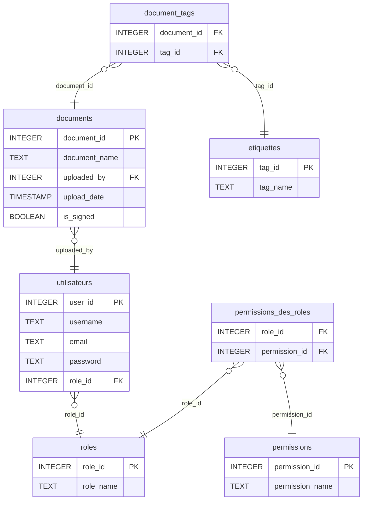

### Explication du diagramme

- **utilisateurs** : Table pour gérer les utilisateurs, contenant l'identifiant de l'utilisateur, le nom d'utilisateur, l'email, le mot de passe et le rôle.
- **rôles** : Table pour définir les rôles disponibles, associée aux utilisateurs et aux permissions.
- **permissions** : Table pour définir les différentes permissions.
- **permissions_des_rôles** : Table pour associer les rôles aux permissions (relation plusieurs-à-plusieurs).
- **documents** : Table pour gérer les documents, incluant les informations sur l'utilisateur qui a uploadé le document, la date d'upload, et si le document est signé.
- **étiquettes** : Table pour gérer les étiquettes de documents.
- **documentTags** : Table pour associer les documents aux étiquettes (relation plusieurs-à-plusieurs).

Utiliser Mermaid pour créer des MLD est une excellente façon de documenter et visualiser la structure de ta base de données dans tes projets. N'hésite pas à poser d'autres questions ou demander plus de détails !
