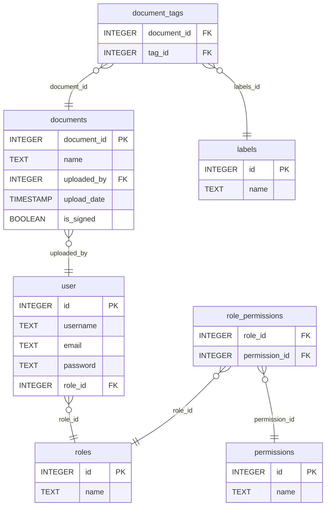

### Explication du diagramme

- **user** : Table pour gérer les utilisateurs, contenant l'identifiant de l'utilisateur, le nom d'utilisateur, l'email, le mot de passe et le rôle.
- **roles** : Table pour définir les rôles disponibles, associée aux utilisateurs et aux permissions.
- **permissions** : Table pour définir les différentes permissions.
- **role_permissions** : Table pour associer les rôles aux permissions (relation plusieurs-à-plusieurs).
- **documents** : Table pour gérer les documents, incluant les informations sur l'utilisateur qui a uploadé le document, la date d'upload, et si le document est signé.
- **labels** : Table pour gérer les étiquettes de documents.
- **document_tags** : Table pour associer les documents aux étiquettes (relation plusieurs-à-plusieurs).
