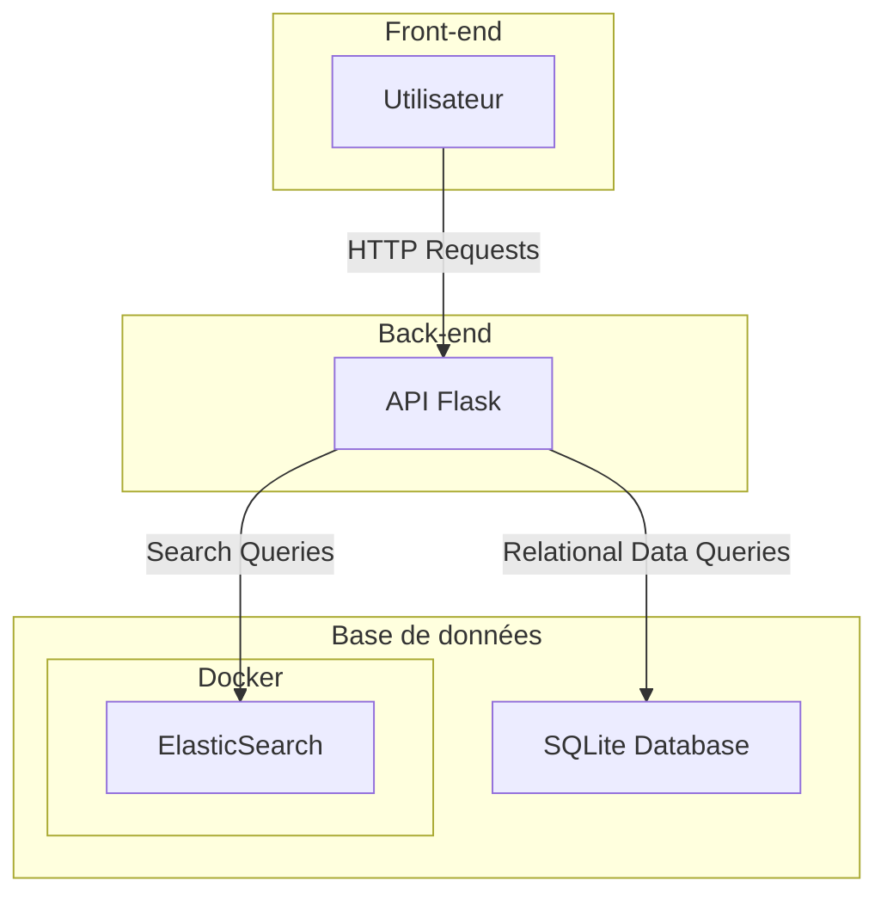

```mermaid
graph TD;
    subgraph Front-end
        User[Utilisateur]
    end

    subgraph Back-end
        FlaskAPI[API Flask]
    end

    subgraph "Base de données"
        SQLite[SQLite Database]
            subgraph Docker
        ElasticSearch[ElasticSearch]
    end
    end


    User -->|HTTP Requests| FlaskAPI
    FlaskAPI -->|Search Queries| ElasticSearch
    FlaskAPI -->|Relational Data Queries| SQLite

```